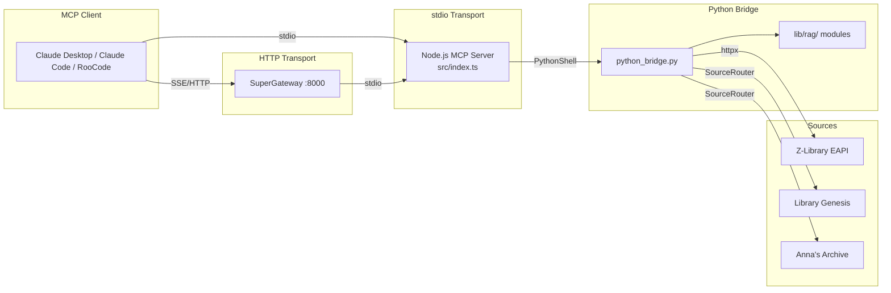

# Z-Library MCP Server

[](https://github.com/rookslog/zlibrary-mcp/actions/workflows/ci.yml)
[](https://www.npmjs.com/package/zlibrary-mcp)
[](https://github.com/rookslog/zlibrary-mcp/blob/master/LICENSE)

A Model Context Protocol (MCP) server that gives AI assistants -- Claude Code, Claude Desktop, RooCode, Cline -- the ability to search for books, download them, and extract document content for Retrieval-Augmented Generation (RAG) workflows. The server reads from Z-Library and Library Genesis. It uses a Node.js/TypeScript MCP frontend and a Python bridge backend for document processing.

For what this project is — and deliberately isn't — see [VISION.md](VISION.md).

## Quick Start

**Prerequisites:** Node.js 22+, Python 3.10+, and [UV](https://docs.astral.sh/uv/)
(`curl -LsSf https://astral.sh/uv/install.sh | sh`)

```bash
npm install -g zlibrary-mcp
cd "$(npm root -g)/zlibrary-mcp" && bash setup-uv.sh --no-dev   # one-time core setup
```

This installs the lightweight core for search, metadata, and downloads. Document
processing is opt-in: run `uv sync --no-dev --extra rag` for PDF/EPUB extraction, or
`uv sync --no-dev --extra scholar` for the complete scholarly/OCR pipeline. See
[Optional Python dependencies](docs/optional-dependencies.md) for the tier details.

Then add the server to your MCP client config (Claude Code `.mcp.json`, Claude Desktop `claude_desktop_config.json`):

```json
{
  "mcpServers": {
    "zlibrary": {
      "command": "zlibrary-mcp"
    }
  }
}
```

This configuration gives you Library Genesis search and downloads. Library Genesis needs
no account and applies no daily limit.

To also use the Z-Library tools, add your credentials:

```json
{
  "mcpServers": {
    "zlibrary": {
      "command": "zlibrary-mcp",
      "env": {
        "ZLIBRARY_EMAIL": "your-email@example.com",
        "ZLIBRARY_PASSWORD": "your-password"
      }
    }
  }
}
```

The server starts without credentials. It writes a warning to stderr and names the tools
that will fail. See [Sources](#sources) for what each source provides.

Developing or contributing? Install [from source](#option-b-from-source-for-development) instead.

## Architecture Overview



- **Node.js/TypeScript MCP Server**: 13 tools registered via McpServer `server.tool()` API (MCP SDK 1.25+)
- **Python Bridge**: Z-Library EAPI client (httpx) + document processing (lib/rag/ modules)
- **Source Router**: routes Library Genesis and Anna's Archive requests, with mirror
  failover on downloads (`lib/sources/`). Z-Library keeps its own path until #40 lands.
- **EAPI Transport**: JSON API endpoints at `/eapi/` bypass Cloudflare browser challenges
- **UV-Based Python Environment**: Project-local `.venv/` with `uv.lock` for reproducible builds
- **Vendored Z-Library Fork**: Custom EAPI client for search and file downloads
- **RAG Pipeline**: EPUB/PDF/TXT extraction with quality detection, output to files (not memory)

## Available MCP Tools (13 Total)

### Search Tools (7)

| Tool | Description |
|------|-------------|
| `search_books` | Basic search by keyword with filters |
| `full_text_search` | Search within book contents |
| `search_by_term` | Conceptual navigation via terms |
| `search_by_author` | Advanced author search |
| `search_advanced` | Fuzzy match detection with separate exact/fuzzy results |
| `search_multi_source` | Search Library Genesis or Anna's Archive (see [Sources](#sources)) |
| `get_recent_books` | Recently added books |

### Metadata Tools (1)

| Tool | Description |
|------|-------------|
| `get_book_metadata` | Complete metadata extraction (terms, descriptions, ratings) |

### Collection Tools (1)

| Tool | Description |
|------|-------------|
| `fetch_booklist` | Expert-curated collection contents |

### Download & Processing Tools (2)

| Tool | Description |
|------|-------------|
| `download_book_to_file` | Download with optional file-based RAG bundle output |
| `process_document_for_rag` | Extract a file-based RAG bundle from EPUB/PDF/TXT |

### Utility Tools (2)

| Tool | Description |
|------|-------------|
| `get_download_limits` | Check daily download quota |
| `get_download_history` | View recent downloads |

For complete parameter documentation, types, and examples, see [API Reference](docs/api.md).

## Sources

The server reads from three sources. Each source has different requirements and different
capabilities.

| Source | Account | Daily limit | Search | Download |
|--------|---------|-------------|--------|----------|
| Library Genesis | No | None | Yes | Yes |
| Z-Library | Yes | Approximately 10 books | Yes | Yes |
| Anna's Archive | API key for downloads | Set by membership | Yes | Only with an API key |

### Library Genesis

Library Genesis needs no account and applies no daily limit. Use it when you reach the
Z-Library limit, or when you do not want an account.

To find a book, call `search_multi_source` with `source: "libgen"`. To download it, pass a
result to `download_book_to_file`.

```jsonc
// 1. Search
{ "query": "Phenomenology of Spirit", "source": "libgen", "count": 5 }

// 2. Download a result. Pass the book object from step 1 as bookDetails.
{ "bookDetails": { "md5": "...", "source": "libgen", "title": "...", "extension": "pdf" },
  "process_for_rag": true }
```

The server resolves a download link at the moment you request the file. It tries the
mirrors `libgen.li`, `libgen.vg`, and `libgen.la` in order. Each mirror sends the file
from a different content delivery network (CDN) node, and these nodes fail independently.
Therefore the server does not accept a mirror until that mirror sends file data. This
behavior routes around a failed CDN node.

Library Genesis download links expire in less than 2.5 hours. The server does not cache
them. An expired link returns the intermediate web page instead of an error, so the server
treats that response as a failure.

### Z-Library

Z-Library needs an account. Set `ZLIBRARY_EMAIL` and `ZLIBRARY_PASSWORD` in your MCP client
config. Without these variables, the Z-Library tools fail when you call them. The other
tools continue to work.

Z-Library applies a daily download limit of approximately 10 books. Call
`get_download_limits` to check your remaining quota.

### Anna's Archive

Anna's Archive search needs no account. Call `search_multi_source` with
`source: "annas"`.

Search without a key returns the title. It also returns the author, the year, the file
format, the file size, and `also_available_on`, which lists the other sources that hold
the same file.

**Note:** all fields except the title are optional. Anna's Archive does not supply the
same data for every record. An absent author, year, format or size is an empty string.
An absent `also_available_on` field is not present in the result.

**Note:** `also_available_on` is a hint, not a guarantee. Anna's Archive reports it, and
the file can leave the other source later. Use it to prefer a source that has no daily
limit. Do not depend on it.

Anna's Archive downloads need a membership API key in `ANNAS_SECRET_KEY`. Without a key,
the server cannot download from Anna's Archive. Anna's Archive protects its free download
route with a browser verification challenge, and this server does not defeat that
protection. Open the record URL in a web browser to download a file without a key.

**Warning:** the fast-download API sends `ANNAS_SECRET_KEY` as a URL parameter. Therefore
the server sends the key only to hosts in `ANNAS_TRUSTED_HOSTS` in `lib/sources/config.py`.
Anna's Archive domains lapse, and other operators re-register them. Do not add a host to
that list until you confirm the host is genuine.

### Check source health

```bash
npm run doctor
```

This command tests each source and reports the result. The Library Genesis test resolves a
download link and reads the first 2 KB of a file. Therefore it detects a broken download
path, not only a reachable web page.

## Installation

### Option A: npm (recommended)

**Prerequisites:** Node.js 22+, Python 3.10+, [UV](https://docs.astral.sh/uv/)

```bash
npm install -g zlibrary-mcp
```

Then set up the Python environment inside the installed package (one-time):

```bash
cd "$(npm root -g)/zlibrary-mcp"
curl -LsSf https://astral.sh/uv/install.sh | sh  # Install UV if needed
bash setup-uv.sh --no-dev
```

The package ships the complete Python bridge (`lib/`, the vendored `zlibrary/`
fork, `pyproject.toml`, `uv.lock`), so no clone is needed. Since v1.3.0 the
release workflow verifies the tag against `package.json` and publishes with
provenance, so the registry version tracks GitHub releases; if
`npm view zlibrary-mcp version` ever trails the
[latest release](https://github.com/rookslog/zlibrary-mcp/releases), that is a
release-pipeline bug worth filing.

### Option B: From Source (for development)

**Prerequisites:** Node.js 22+, Python 3.10+, [UV](https://docs.astral.sh/uv/)

```bash
# 1. Install UV (one-time, if not already installed)
curl -LsSf https://astral.sh/uv/install.sh | sh

# 2. Clone and build
git clone https://github.com/rookslog/zlibrary-mcp.git
cd zlibrary-mcp
git lfs pull         # Hydrates LFS-tracked test PDFs (don't run `git lfs install`;
                     # it conflicts with the repo's Husky-managed hooks)
bash setup-uv.sh    # Creates .venv/ with every tier plus the dev group
npm install          # Installs Node.js dependencies
npm run build        # Compiles TypeScript to dist/
```

The source bootstrap installs **every optional tier along with the contributor
tools**, because part of the fast test suite imports scholar-tier modules while
collecting — a core-only contributor environment cannot run the project's own
verification. Nothing further is needed to work on the RAG pipeline or to run
the complete Python suite.

End users want a smaller install: see [Optional Python dependencies](docs/optional-dependencies.md).

**MCP client configuration (stdio transport):**

Claude Code (`.mcp.json` in your project root):

```json
{
  "mcpServers": {
    "zlibrary": {
      "command": "node",
      "args": ["/absolute/path/to/zlibrary-mcp/dist/index.js"],
      "env": {
        "ZLIBRARY_EMAIL": "your-email@example.com",
        "ZLIBRARY_PASSWORD": "your-password"
      }
    }
  }
}
```

RooCode / Cline (`mcp_settings.json`):

```json
{
  "mcpServers": {
    "zlibrary-local": {
      "command": "node",
      "args": ["/absolute/path/to/zlibrary-mcp/dist/index.js"],
      "env": {
        "ZLIBRARY_EMAIL": "your-email@example.com",
        "ZLIBRARY_PASSWORD": "your-password"
      },
      "transport": "stdio",
      "enabled": true
    }
  }
}
```

### Option C: Docker (HTTP transport)

**Prerequisites:** Docker

Versioned images are published to GHCR on every release (`latest`, `1.4`,
`1.4.0`, …) — no clone or build needed:

```bash
docker run -d --name zlibrary-mcp -p 8000:8000 \
  -e ZLIBRARY_EMAIL="your-email@example.com" \
  -e ZLIBRARY_PASSWORD="your-password" \
  -v "$PWD/downloads:/app/downloads" \
  ghcr.io/rookslog/zlibrary-mcp:latest
```

The image wraps the stdio server in
[SuperGateway](https://github.com/supercorp-ai/supergateway), exposing MCP over
SSE at `http://localhost:8000/sse`. Verify it's serving:

```bash
curl -s -N --max-time 3 http://localhost:8000/sse | head -2
# event: endpoint
# data: /message?sessionId=...
```

The image includes the `rag` tier, so PDF and EPUB extraction work without an
additional install step. It does not include the `scholar` tier. In particular,
OpenCV-backed X-mark detection remains unavailable on Alpine; see [Optional
Python dependencies](docs/optional-dependencies.md) for the tier boundaries.

**Building from source instead** (adds a `/health` endpoint via compose):

```bash
git clone https://github.com/rookslog/zlibrary-mcp.git && cd zlibrary-mcp
cp docker/env.example docker/.env   # then edit in your credentials
docker compose -f docker/docker-compose.yaml up -d
curl http://localhost:8000/health
```

**MCP client configuration (SSE/HTTP transport):**

```json
{
  "mcpServers": {
    "zlibrary": {
      "command": "npx",
      "args": ["-y", "supergateway", "--sse", "http://localhost:8000/sse"]
    }
  }
}
```

## Output Format (RAG Processing)

The RAG pipeline processes downloaded documents (EPUB, PDF, TXT) into clean text files for use in retrieval-augmented generation workflows.

PDF and EPUB processing require `uv sync --no-dev --extra rag`. Scholarly analysis and OCR
require `uv sync --no-dev --extra scholar`, which includes the RAG tier. If a required tier is
missing, the operation returns the exact `uv sync` command to install it.

- **Output location:** Processed text files are saved to `./processed_rag_output/`
- **File-based output:** Tools return file paths rather than raw text content, avoiding context overflow in AI assistants
- **Bundle contract:** `processed_file_path` remains the body-text anchor, with additive sibling fields like `metadata_file_path`, optional `footnotes_file_path`, and an `output_files` map when available
- **Supported formats:** EPUB, PDF, and TXT
- **Quality detection:** The pipeline automatically detects document quality (OCR vs. digital text) and applies appropriate extraction strategies
- **Scholarly formatting:** Preserves footnotes, chapter structure, and academic formatting where possible

Use `download_book_to_file` with `process_for_rag: true` for combined download and processing, or `process_document_for_rag` to process an existing file.

## Configuration

The server requires Z-Library credentials, set as environment variables:

| Variable | Required | Description |
|----------|----------|-------------|
| `ZLIBRARY_EMAIL` | Unless using an account pool | Z-Library account email |
| `ZLIBRARY_PASSWORD` | Unless using an account pool | Z-Library account password |
| `ZLIBRARY_ACCOUNT_CREDENTIALS` | No | Secret JSON array of email/password objects; overrides the single-account pair |
| `ZLIBRARY_SESSION_DIR` | No | Private session directory; defaults to `~/.cache/zlibrary-mcp/sessions` |
| `ZLIBRARY_MIRROR` | No | Custom Z-Library mirror URL |

Z-Library operations validate credentials when called; credential-free sources remain available.

### Sessions and automatic account selection

Successful logins are reused across Python bridge invocations. Session cookies are
stored outside downloads, with directory mode 0700 and file mode 0600 on POSIX.
Keep this directory on persistent local storage if the MCP runs in a container.
A profile request validates a cached session; only an explicit login rejection
causes reauthentication. Network failures do not cause repeated logins. When the
upstream rejects excessive logins, a five-minute local cooldown prevents immediate
retries; the upstream may require longer before it accepts another login.

For multiple accounts, set `ZLIBRARY_ACCOUNT_CREDENTIALS` to a JSON array of objects
with `email` and `password` fields, using your MCP client's secret/environment
configuration. Never put real credentials in repository files or tool arguments.
The array replaces the legacy single-account pair when present.

Search and history use the first account. `get_download_limits` reports the pool
total and per-account quotas. Before a pooled Z-Library download, the
bridge reads each account's actual daily limit and usage and selects the first
account with remaining quota. Selection and download are serialized across bridge
processes sharing the session directory. The result's `account_index` is the
one-based position of the selected account; email addresses are not returned.
Unknown quota, login restrictions, and download errors stop the operation without
rotating accounts or replaying a download. When all quotas are exhausted, the error
says so. Activity outside this MCP can still consume quota concurrently.

### Logging

Diagnostics go to **stderr**, never stdout: under the stdio transport stdout is the
JSON-RPC channel, and anything else written there corrupts the protocol stream and
causes clients to disconnect. Your MCP client captures stderr into its own logs.

| Variable | Default | Description |
|----------|---------|-------------|
| `LOG_LEVEL` | `info` | `silent`, `error`, `warn`, `info`, or `debug` |

`debug` adds per-request argument tracing, which **includes your search queries**.
Scrub client logs before attaching them to a bug report.

### Diagnosing problems

```bash
npm run doctor
```

This probes Z-Library, Anna's Archive, and LibGen directly and reports which
respond. Those are undocumented third-party services that change domains without
notice, so an upstream outage and a bug in this server look identical from an MCP
client. Run this before filing an issue — and see
[TROUBLESHOOTING.md](docs/TROUBLESHOOTING.md) for the setup-related causes of a
server that exits immediately.

### Retry and Circuit Breaker

All API operations include automatic retry with exponential backoff and circuit breaker protection. These are configurable via environment variables:

| Variable | Default | Description |
|----------|---------|-------------|
| `RETRY_MAX_RETRIES` | `3` | Maximum retry attempts |
| `RETRY_INITIAL_DELAY` | `1000` | Initial retry delay (ms) |
| `RETRY_MAX_DELAY` | `30000` | Maximum retry delay (ms) |
| `RETRY_FACTOR` | `2` | Exponential backoff multiplier |
| `CIRCUIT_BREAKER_THRESHOLD` | `5` | Failures before opening circuit |
| `CIRCUIT_BREAKER_TIMEOUT` | `60000` | Time (ms) before retry after circuit opens |

See [docs/RETRY_CONFIGURATION.md](docs/RETRY_CONFIGURATION.md) for details.

Multi-source search, URL resolution, and complete file transfers have separate
finite wall-clock budgets. On POSIX, aborting a bridge call cooperatively cancels
Python cleanup before process-group escalation, so partial download artifacts are
removed. Permanent Anna credential and quota errors fail immediately without
consuming retry or shared circuit-breaker health budgets.

## Development

### Running Tests

```bash
# Node.js tests (Jest only -- npm test does not run pytest)
npm test

# Python tests -- fast suite (the routine command)
uv run pytest -m "not slow and not integration and not performance"

# Python tests -- full corpus (requires LFS-hydrated test PDFs)
uv run pytest

# Specific Python test
uv run pytest __tests__/python/test_rag_processing.py
```

### Building

```bash
npm run build
```

## FAQ

### Why EAPI instead of HTML scraping?

Z-Library deployed Cloudflare browser challenges (Jan 2026) that block all HTML page requests from automated clients. The EAPI JSON endpoints at `/eapi/` are not subject to these challenges, providing reliable programmatic access. See `docs/adr/ADR-005-EAPI-Migration.md`.

### Why use `node` in .mcp.json instead of `uv`?

The MCP server is a Node.js application. UV is only used during setup (`uv sync`) to create `.venv/` and install Python dependencies. At runtime, Node.js runs the MCP server which calls `.venv/bin/python` internally.

```
Setup:  uv sync --> creates .venv/
Build:  npm run build --> compiles TypeScript to dist/
Runtime: node dist/index.js --> runs MCP server --> calls .venv/bin/python internally
```

### What if I move the project directory?

No problem. `.venv/` moves with the project (UV creates project-local environments).

## Contributing

Contributions are welcome! See [CONTRIBUTING.md](CONTRIBUTING.md) for setup instructions, code style, testing, and PR workflow.

## License

This project is licensed under the MIT License - see the LICENSE file for details.

## Disclaimer

This tool is provided for educational and research purposes only. Users are responsible for complying with all applicable laws and regulations regarding the downloading and use of copyrighted materials. Accessing Z-Library may be restricted in certain jurisdictions.
